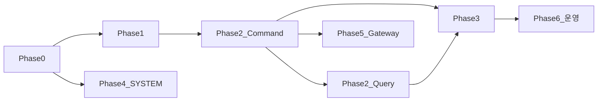

# plip-chat 백엔드 페이즈별 구현 플랜

> WBS·진행 상태·API 계약·리스크. 지속적 제약은 `DEVELOPMENT_GUIDE.md`, `GIT_CONVENTION.md` 참고.  
> **기준:** plip-chat `develop` @ `496898e`, plip-user-app `develop` @ `126866e` (2026-08-25)

---

## 페이즈 구분 (한눈에)

| Phase | 성격 |
|-------|------|
| 0–1 | 계약·E2E 기반 |
| 2 Command | 읽음 **쓰기** (MarkChatRead) ✅ |
| 2 Query | unread **조회** (배지용) — **보류** |
| 3 | 발신자 receipt (버블 unread) — **보류** |
| **4** | **추가 SYSTEM 메시지** (Kafka → 채팅방) — **진행 중** |
| 5 | Gateway WS ticket FE·BE ✅ |
| 6 | 운영·인프라·부가 API |

---

## 현재 상태 요약

**완료**

- Phase 0–1: 계약 테스트, E2E bootstrap (#18)
- Phase 2 Command: MarkChatRead monotonic, `member_reads`, `MemberReadUpdated` (#18)
- Gateway BE: WS ticket (#20), Docker·경로 계약 (#22)
- FE Phase 1: REST·STOMP (#118)
- **Phase 5: Gateway WS ticket FE (#132, PR #133)** — `issueChatWsTicketAction`, `buildChatWsGatewayUrl`, `beforeConnect` 재발급, `CHAT_WS_URL` 제거

**다음 작업 (우선순위)**

1. **Phase 2 Query** — 보류 (`unreadMessageCount`)
2. **Phase 3** — 보류 (`unreadMemberCount`)
3. **Phase 6** — 필요 시

Phase 4 (#24) — member-left SYSTEM 1종 추가.

### unread 두 가지

| 개념 | 대상 | FE | Phase |
|------|------|-----|-------|
| `unreadMessageCount` | 수신자 — 내가 안 읽은 TALK | 아지트 목록 배지 | **2 Query** |
| `unreadMemberCount` | 발신자 — 내 메시지 안 읽은 멤버 | 버블 tip | **3** |

### 아키텍처 결정: 배치 API + FE merge

- **SSOT:** plip-chat (`GET /me/agits/chat-unread`)
- **merge:** plip-user-app `agitService.listMyAgits` — `Promise.all` 후 `agitUuid` join
- **하지 않음:** plip-agit `GET /agits/me`에 embed

---

## Phase 0 — 계약 고정 ✅ (#18)

- OpenAPI bearerAuth, `ChatControllerTest`, `ChatWebSocketControllerTest`
- TALK content 검증, FE 타입 매핑

---

## Phase 1 — read model bootstrap + E2E ✅ (#18)

- `LocalChatE2EBootstrapIntegrationTest`
- develop-env chat profile 등록

---

## Phase 2 Command — MarkChatRead ✅ (#18)

- `POST /read` optional `{ readAt }`, monotonic, idempotent 204
- Redis `user:read_state`, `agit:{uuid}:member_reads`
- `MemberReadUpdated` 이벤트

---

## Phase 2 Query — unreadMessageCount ⬜ **보류**

**목표:** 아지트별 미읽음 TALK 개수 → 목록·메뉴 배지

```text
unreadMessageCount =
  count(TALK where createdAt > myReadAt and senderUuid != me)
```

**plip-chat (미구현)**

- [ ] `ChatStateQueryPort` — `getReadAt`, `getLastChatAt`, `getMemberReadAtMap`
- [ ] `ChatMessagePersistencePort.countUnread(...)`
- [ ] `GET /api/v1/agits/{agitUuid}/chat-state`
- [ ] `GET /api/v1/me/agits/chat-unread` (배치, optional `agitUuids`)
- [ ] (선택) `/sub/users/{userUuid}/chat-inbox` WS patch

**plip-user-app (미구현, BE 후 FE 이슈)**

- [ ] `chatApi.getMyAgitsChatUnread`, `agitService.listMyAgits` merge
- [ ] `UiAgit.chatUnreadCount`, `AgitListRow` 숫자 배지

---

## Phase 3 — unreadMemberCount + receipt ⬜ **보류**

**목표:** 내가 보낸 tip 메시지 옆 "안 읽은 멤버 수"

- [ ] History/WS `unreadMemberCount` enrich (tip만)
- [ ] TALK send 시 초기 count = activeMemberCount - 1
- [ ] `ReadReceiptProjector` ← `MemberReadUpdated`
- [ ] WS `/sub/agits/{uuid}/receipts`

---

## Phase 4 — 시스템 메시지 ✅ (#24)

**브랜치:** `feature/24-system-message-events` → PR

| 이벤트 | 본문 | 상태 |
|--------|------|------|
| `agit.member-left` | `{nickname}님이 퇴장했습니다.` | ✅ **#24 유일 추가** |
| `agit.deleted` | — | **제외** (삭제 후 채팅 403) |
| `topic.unbound` | — | **제외** (채팅 UX 불필요) |
| `video.uploaded` | 스펙 확정 후 | 보류 (#15) |

**#8 기존 4종:** member-joined, member-banned, topic.bound, topic.started

---

## Phase 5 — Gateway WS ticket ✅

| 작업 | BE | FE |
|------|----|----|
| `POST /api/chat/api/v1/ws/ticket` | ✅ #20 | ✅ `issueWsTicket` |
| `/api/chat/ws/chat?ticket=` | ✅ #22 | ✅ `buildChatWsGatewayUrl` |
| 재연결 시 ticket 재발급 | ✅ | ✅ `beforeConnect` |
| `CHAT_WS_URL`·STOMP `X-User-UUID` | — | ✅ 제거 (#132) |

REST·WS 모두 `API_URL` Gateway 경유. `ENABLE_REMOTE_CHAT=true`로 원격 모드.

---

## Phase 6 — 운영·확장 ⬜

prod 배포·품질·편의 기능 백로그 (핵심 채팅 UX와 별도).

| 작업 | 설명 |
|------|------|
| WS E2E 테스트 | connect → send → subscribe → (Phase 3 후) receipt 전 구간 자동화 |
| `GET /messages/{messageId}` | 채팅 전체보기(`/chat/m/[id]`)가 sessionStorage 대신 단건 fetch |
| read index 정리 | LEFT/BANNED 멤버를 count 계산에서 제외 (ACTIVE 필터로 대부분 충족) |
| 알림 mute | user-service 연동 — **chat 범위 밖**, 별도 이슈 |

Phase 2 Query·3 receipt가 끝난 뒤, UX/운영 필요에 따라 순차 진행.

---

## FE 연동 매핑

| Phase | plip-user-app | 상태 |
|-------|---------------|------|
| 0–1 | `getChatHistoryAction`, `ENABLE_REMOTE_CHAT` | ✅ #118 |
| 5 | ticket + Gateway WS | ✅ #132 |
| 2 Query | `chatUnreadCount` merge + 배지 | ⬜ |
| 3 | tip `unreadMemberCount`, `/receipts` | ⬜ |
| 6 | 전체보기 단건 API | ⬜ |

---

## 권장 순서



**현재:** Phase 4 (#24) ✅ → **다음: Phase 2 Query 또는 Phase 3** (보류)

---

## GitHub 이슈

| 이슈 | Phase | 상태 |
|------|-------|------|
| plip-chat #18 | 0–2 Command | CLOSED |
| plip-chat #20, #22 | 5 BE | CLOSED |
| plip-user-app #118 | 0–1 FE | CLOSED |
| plip-user-app #132 | 5 FE | CLOSED |
| plip-chat #15 | 4 SYSTEM (모) | OPEN |
| plip-chat #24 | 4 SYSTEM | **PR** |
| (신규) | 2 Query BE | 미생성 |
| (신규) | 2 Query FE 배지 | 미생성 |
| (신규) | 3 receipt | 미생성 |

---

## 리스크·결정

1. readAt은 FE가 `lastVisibleMessage.createdAt` body 전달 권장
2. unread 배치 API는 plip-chat 전용, agit embed 안 함
3. chat-unread 실패 시 FE 목록 degrade (count만 omit)
4. Gateway WS: REST·WS 모두 Gateway 단일 진입 (#132 완료)
